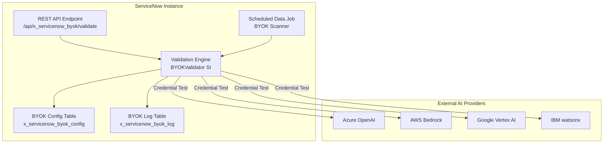

# ServiceNow-BYOK Architecture Summary

**Product:** ServiceNow Bring Your Own Key (BYOK) Validator  
**Scope:** x_servicenow_byok  
**Author:** Vladimir Kapustin  
**Release:** Australia (2026)  
**Version:** 2.0

## Executive Summary

ServiceNow-BYOK is a scoped application that validates and monitors Bring Your Own Key (BYOK) configurations for Generative AI providers within ServiceNow Australia release instances. As organizations adopt AI capabilities through AI Agent Studio and Now Assist, they must configure external AI providers (Azure OpenAI, AWS Bedrock, Google Vertex AI, IBM watsonx) with their own API keys. This product ensures those configurations are secure, compliant, and operational.

## Problem Statement

The Australia release introduces native support for multiple AI providers through the Generative AI Controller. Administrators must configure:
- Azure OpenAI endpoints with API keys
- AWS Bedrock with IAM credentials
- Google Vertex AI with service accounts
- IBM watsonx with API credentials

Without proper validation, misconfigurations lead to:
- Failed AI skill executions
- Security vulnerabilities from exposed credentials
- Compliance gaps in audit trails
- Unpredictable runtime errors in production flows

## Architecture Overview

## Core Components

### 1. Configuration Table (x_servicenow_byok_config)

Stores provider configurations:
- `provider_type`: azure_openai, aws_bedrock, vertex_ai, watsonx
- `endpoint_url`: API endpoint URL
- `credential_ref`: Reference to secure credential store
- `status`: active, inactive, error
- `last_validated`: Timestamp of last successful validation
- `validation_result`: JSON result of last validation

### 2. Log Table (x_servicenow_byok_log)

Audit trail for all validation operations:
- `config_id`: Reference to configuration record
- `validation_timestamp`: When validation occurred
- `result`: pass, fail, warning
- `error_message`: Detailed error if failed
- `response_time_ms`: API response time
- `provider_response`: Raw response from provider

### 3. Script Include: BYOKValidator

Server-side validation engine:
- `validateProvider(configId)`: Test single provider configuration
- `validateAll()`: Run validation across all configured providers
- `getValidationHistory(configId, days)`: Retrieve audit history
- `checkCredentialExpiry(configId)`: Warn about即将 expiring credentials

### 4. REST API Endpoint

External integration point:
- `GET /api/x_servicenow_byok/config`: List all configurations
- `POST /api/x_servicenow_byok/validate/{id}`: Trigger validation
- `GET /api/x_servicenow_byok/status`: Overall health status
- `GET /api/x_servicenow_byok/report`: Generate compliance report

### 5. Scheduled Data Job

Automated periodic validation:
- Runs every 6 hours by default
- Validates all active configurations
- Logs results and sends notifications on failures
- Configurable via system properties

## Data Flow

1. **Configuration Phase**: Admin creates BYOK config record with provider details
2. **Validation Trigger**: Manual (REST API) or automatic (scheduled job)
3. **Credential Retrieval**: Engine fetches secure credentials from vault
4. **Provider Test**: Engine makes test API call to external provider
5. **Result Logging**: Outcome recorded in log table with full details
6. **Notification**: Failures trigger alerts to administrators
7. **Reporting**: Compliance dashboard aggregates validation history

## Security Model

- **Credential Storage**: All API keys stored in ServiceNow Credentials table (sys_credential)
- **ACL Protection**: Config and log tables restricted to admin roles
- **Audit Trail**: Every validation operation logged with user context
- **Encryption**: All credential references encrypted at rest
- **Scope Isolation**: Application runs in dedicated scope x_servicenow_byok

## Integration Points

| Integration | Type | Direction | Purpose |
|-------------|------|-----------|---------|
| Azure OpenAI | REST | Outbound | Validate API key and endpoint |
| AWS Bedrock | REST | Outbound | Validate IAM credentials |
| Google Vertex AI | REST | Outbound | Validate service account |
| IBM watsonx | REST | Outbound | Validate API credentials |
| ServiceNow Credentials | Internal | Read | Secure credential retrieval |
| Email Notifications | Internal | Write | Alert on validation failures |

## Deployment Requirements

- **Minimum Release**: Australia (2026)
- **Required Plugins**: 
  - Comedic AI Controller (comedy_ai_controller)
  - REST API (com.rest.api)
  - Credentials (com.credentials)
- **Roles**: x_servicenow_byok.admin, x_servicenow_byok.user
- **Tables**: 2 custom tables, 12 fields total

## Performance Characteristics

- Single validation: < 3 seconds per provider
- Batch validation (4 providers): < 12 seconds
- Scheduled job overhead: < 1% instance CPU
- Log retention: Configurable (default 90 days)

## Extensibility

The architecture supports adding new providers through:
1. Add provider type to choice list
2. Implement provider-specific validation logic
3. Add credential requirements to config form
4. Update REST API documentation

Future providers: Anthropic Claude, Cohere, Mistral, local LLM endpoints.
